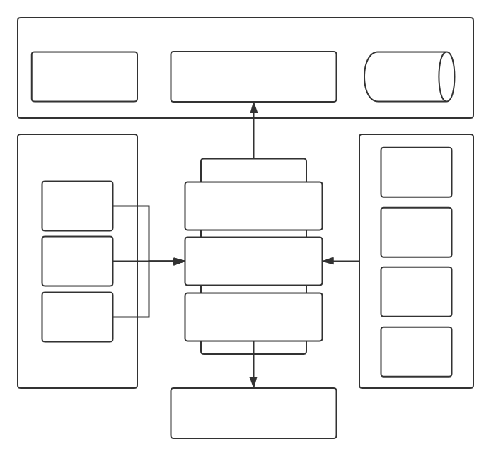

<h1 align="center">FITCH</h1>
<p align="center">
    <em>基于 opencv 的 Android UI自动化解决方案</em>
</p>

---

[](https://codeclimate.com/github/williamfzc/fitch/maintainability)
[](https://badge.fury.io/py/fitch)
[](https://fitch.readthedocs.io/en/latest/?badge=latest)

---

# 使用

## 创建与销毁

FDevice的使用有两种方式。如果只是简单功能，你可以选择with。它会在使用结束后自动销毁设备：

```python
from fitch.device import safe_device

with safe_device('123456F') as device:
    print(device.device_id)
```

如果你希望自主控制设备：

```python
from fitch import FDevice

device = FDevice('123456F')

# do something
print(device.device_id)

# stop your device
device.stop()
```

## 寻找目标

```python
TARGET_PICTURE_PATH = 'path/to/your/picture.png'

point_location = device.find_target(TARGET_PICTURE_PATH)
```

当相似度未达到阈值时，返回None。否则返回坐标。你可以按照下列方法修改阈值（默认0.8）：

```python
from fitch import config
config.CV_THRESHOLD = 0.9
```

## 点击目标

```python
TARGET_PICTURE_PATH = 'path/to/your/picture.png'

result = device.tap_target(TARGET_PICTURE_PATH)
# true or false
```

你可以直接寻找并点击图片。它会返回bool类型的结果，代表操作成功与否。

## 远程模式

基于 [findit](https://github.com/williamfzc/findit)，你可以将目标图片配置到远程，之后直接使用，这样更有利于大量图片的管理。

把图片配置到远程（例子中放置在 `path/to/your/remote` 目录下）：


然后像调用本地图片一样调用它即可：

```python
from fitch import config

# 配置你的findit服务器
config.REMOTE_MODE = True
config.FINDIT_SERVER_IP = '172.17.12.34'
config.FINDIT_SERVER_PORT = 29412

# 直接使用你的远端图片
TARGET_PICTURE_PATH = 'path/to/your/remote/picture.png'
point_location = device.find_target(TARGET_PICTURE_PATH)
```

关于findit服务器配置可参考：https://williamfzc.github.io/findit/#/usage/client+server

## 点击坐标

如果你希望让这一切更加灵活：

```python
point_location = device.find_target(TARGET_PICTURE_PATH)

# some assert to check it?
assert point_location, f'picture {TARGET_PICTURE_PATH} not existed'

# tap it
device.tap_point(point_location)

# or long click?
device.tap_point(point_location, duration=1000)
```

## 界面无关的额外操作

除了ui操作外，我们可能需要一些类似adb的界面无关操作：

```python
device.extras.switch_airplane(True)
```

可以通过 extras 调用 [adbutils](https://github.com/openatx/adbutils) 中的功能。

# 如何运作



得益于 [minitouch](https://github.com/openstf/minitouch) / [minicap](https://github.com/openstf/minicap) / [opencv](https://github.com/skvark/opencv-python) 的存在，让 fitch 能够维持高效地运转，即便它是用python写的。

- 获得手机屏幕截图（[fastcap](https://github.com/williamfzc/fastcap)）
- 在截图上寻找目标模板，并确定它的位置（[findit](https://github.com/williamfzc/findit)）
- 进行检查或操作（[pyminitouch](https://github.com/williamfzc/pyminitouch) & [adbutils](https://github.com/openatx/adbutils)）

# 安装

Python 3.6 +

## 从 pypi 安装

```shell
pip install fitch
```

## 从 github源码 安装

如果你希望获取一些还未release的新特性，你可以直接通过源码安装。

```shell
git clone https://github.com/williamfzc/fitch.git
cd fitch
pip install -e .
```

# 依赖库

- [pyminitouch](https://github.com/williamfzc/pyminitouch): ui操作
- [findit](https://github.com/williamfzc/findit): 目标检测
- [fastcap](https://github.com/williamfzc/fastcap): 快速获取截图
- [adbutils](https://github.com/openatx/adbutils): 非ui操作

# 协议

[MIT](LICENSE)
